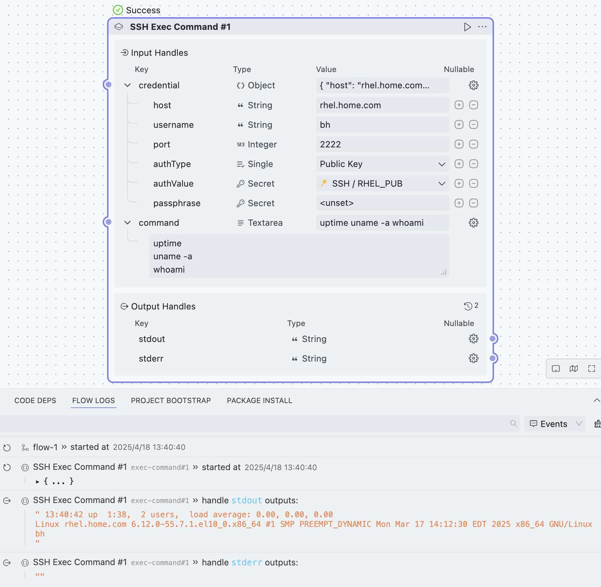
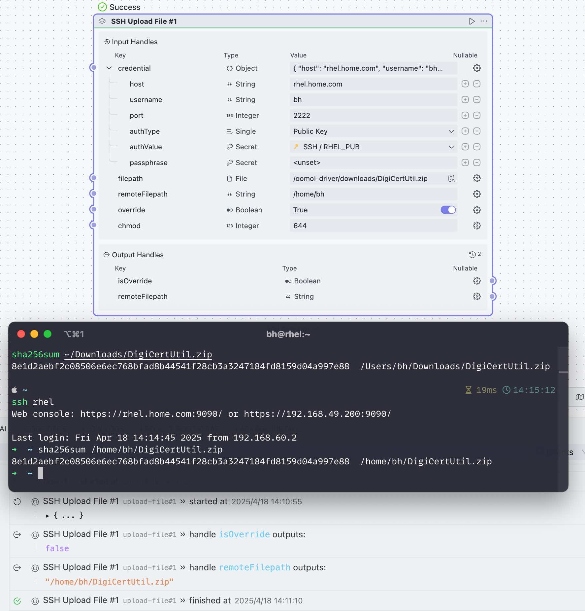

<!-- filepath: /Users/bh/code/oomol/ssh/README.md -->
<div align=center>
  <h1>SSH</h1>
  <p>
    <a href="https://github.com/oomol-flows/ssh/blob/main/LICENSE" target="_blank"></a>
  </p>
  <p><a href="https://hub.oomol.com/package/ssh?open=true" target="_blank"></a></p>
</div>

## Share Block

### SSH Credential Config


Configure SSH credentials for reuse by other tasks.

**Input Parameters**:

- `host`: Remote server host.
- `username`: SSH username.
- `port`: SSH port (default: `22`).
- `authType`: Authentication type (_password_, _privateKey_, or _publicKey_).
- `authValue`: Authentication value (password or key).
- `passphrase`: Optional - passphrase for the private key.

**Output**:

`credential` object, which is equivalent to the input parameters.

When `authType` is _publicKey_, `authValue` is the public key content. OOMOL Studio will send authentication requests to the _SSH Agent_ in the current operating system. This is ideal for cases where private keys are stored in password management tools such as 1Password.

Related documentation: [1Password SSH](https://developer.1password.com/docs/ssh/get-started/)

Note that: `publicKey` is currently only supported on `MacOS` operating systems.

### SSH Exec Command



Execute commands on a remote server.

> Note:
> If the command spans multiple lines, even if one command fails, it will continue to execute the rest without exiting. If you want any command failure to cause an error and exit, please use `set -e`. For example:
> ```shell
> set -e
> not_found_command
> echo Hi
> ```

**Input Parameters**:

- `credential`: SSH credentials (host, username, port, authentication type, authentication value, passphrase).
- `command`: The command to execute.

**Output**:

- `stdout`: The stdout of the executed command
- `stderr`: The stderr of the executed command

### SSH Download File


Download files from a remote server.

**Input Parameters**:

- `credential`: SSH credentials.
- `remoteFilepath`: Remote file path.
- `saveFilepath`: Local save path. If a folder is provided, the filename will be the same as the remote file.
- `override`: Whether to override local files (default: `true`).

**Output**:

- `isOverride`: Whether the local file was overridden.
- `saveFilepath`: Local save path.

### SSH Upload File



Upload local files to a remote server.

**Input Parameters**:

- `credential`: SSH credentials.
- `filepath`: Local file path.
- `remoteFilepath`: Remote save path. If a folder is provided, the filename will be the same as the local file.
- `override`: Whether to override remote files (default: `true`).
- `chmod`: Optional - Set remote file permissions (default: `644`).

**Output**:

- `isOverride`: Whether the remote file was overridden.
- `remoteFilepath`: Remote save path.

### SSH Upload Content


Upload text content to a remote server.

**Input Parameters**:

- `credential`: SSH credentials.
- `fileContent`: File content to upload.
- `remoteFilepath`: Remote save path.
- `override`: Whether to override remote files (default: `true`).
- `chmod`: Optional - Set remote file permissions (default: `644`).

**Output**:

- `fileSize`: Size of the remote file after upload.
- `isOverride`: Whether the remote file was overridden.
