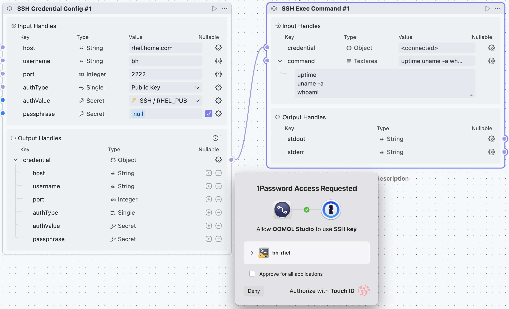
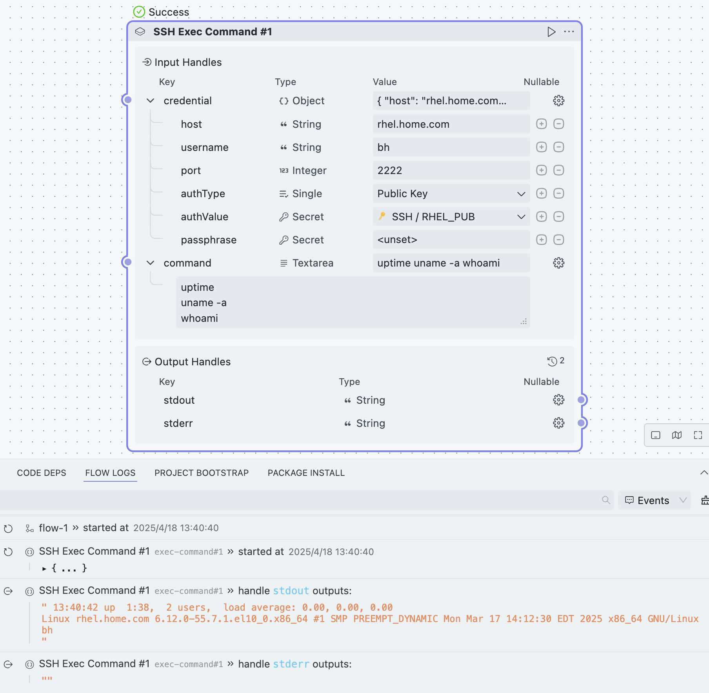
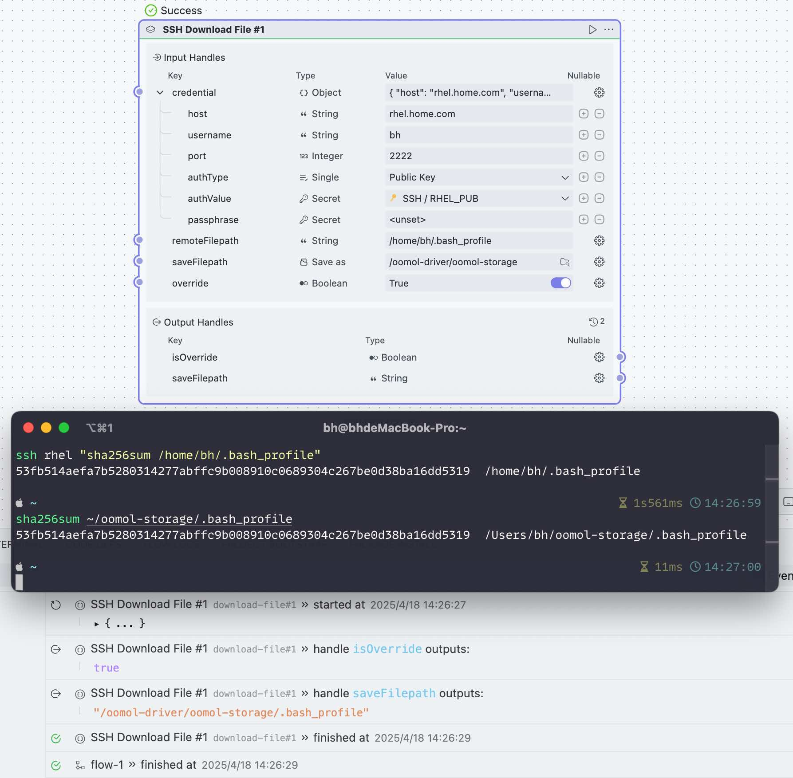
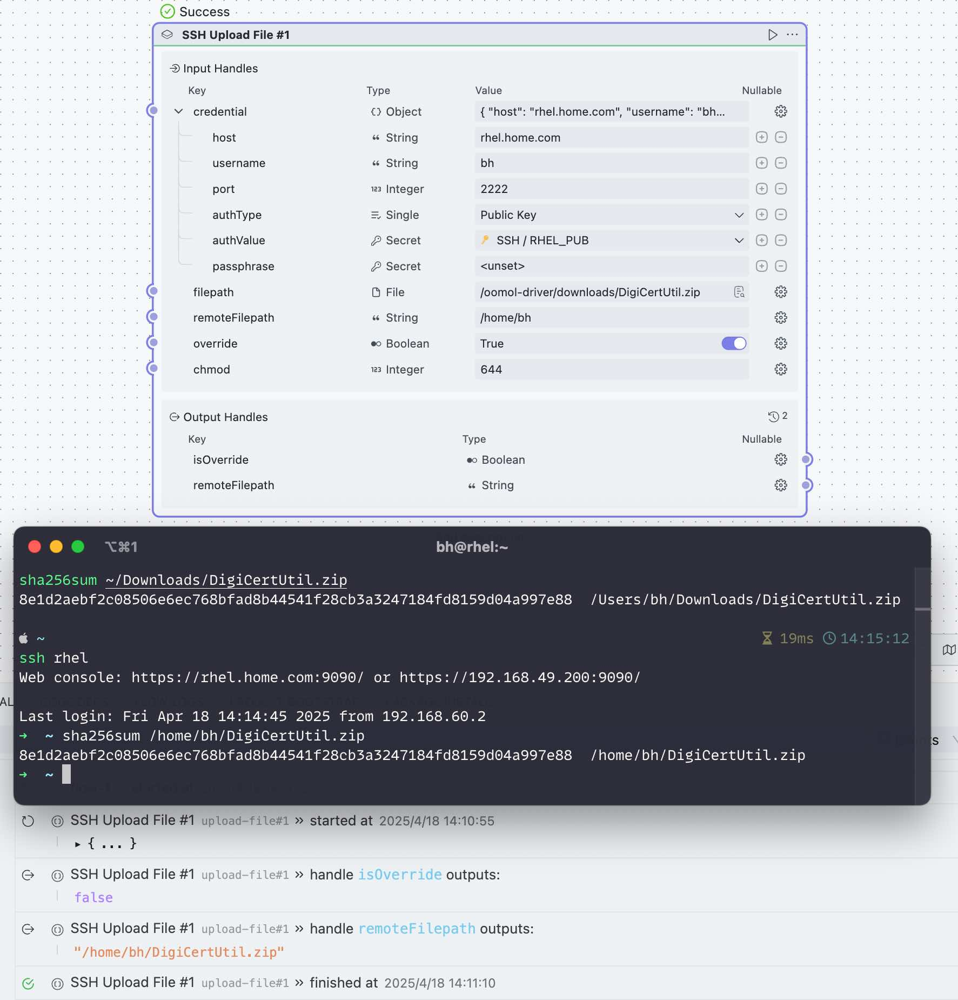
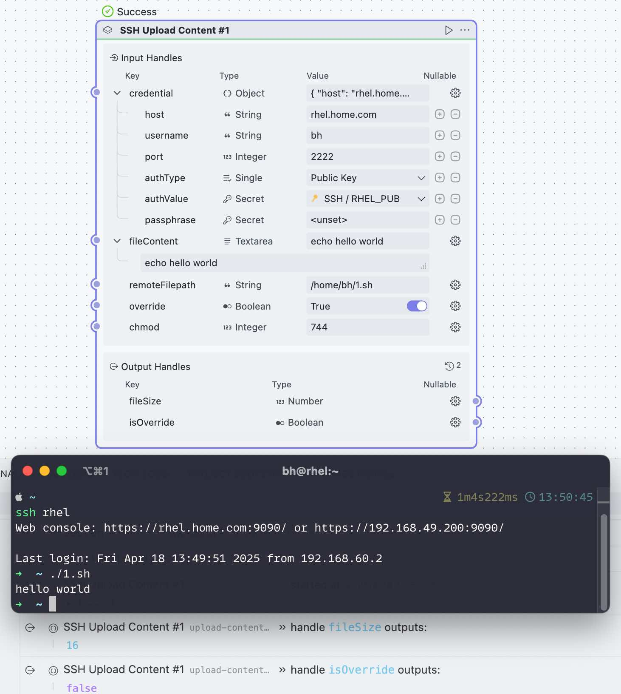

<div align=center>
  <h1>SSH</h1>
  <p>
    <a href="https://github.com/oomol-flows/ssh/blob/main/LICENSE" target="_blank"></a>
  </p>
  <p><a href="https://hub.oomol.com/package/ssh?open=true" target="_blank"></a></p>
</div>

## Share Block

### SSH Credential Config



配置 SSH 凭据以供其他任务复用。

**输入参数**:

- `host`: 远程服务器主机。
- `username`: SSH 用户名。
- `port`: SSH 端口（默认: `22`）。
- `authType`: 认证类型（_password_、_privateKey_ 或 _publicKey_）。
- `authValue`: 认证值（密码或密钥）。
- `passphrase`: 可选 - 私钥的密码短语。

**输出**:

`credential` 对象，此对象等价于 input 的参数。

当 `authType` 为 _publicKey_ 时，`authValue` 为公钥内容。OOMOL Studio 将会向当前操作系统里的 _SSH Agent_ 发送认证请求。这非常适合: 私钥保存在例如 1Password 等密码管理工具里的情况。

相关文档: [1Password SSH](https://developer.1password.com/docs/ssh/get-started/)

需要注意的是: `publicKey` 目前仅支持 `MacOS` 操作系统。

### SSH Exec Command



在远程服务器上执行命令。

> 注意:
> 如果命令是多行情况，即使其中一个命令失败，仍然会继续向下执行，不会退出。如果你想：任意一个命令失败，则报错退出，请使用 `set -e`。例如:
> ```shell
> set -e
> not_found_command
> echo Hi
> ```

**输入参数**:

- `credential`: SSH 凭据（主机、用户名、端口、认证类型、认证值、密码短语）。
- `command`: 要执行的命令。

**输出**:

- `stdout`: 执行命令的 stdout
- `stderr`: 执行命令的 stderr

### SSH Download File



从远程服务器下载文件。

**输入参数**:

- `credential`: SSH 凭据。
- `remoteFilepath`: 远程文件路径。
- `saveFilepath`: 本地保存路径，如果提供的是文件夹，则文件名将与远程文件名相同。
- `override`: 是否覆盖本地文件（默认: `true`）。

**输出**:

- `isOverride`: 是否覆盖本地了文件。
- `saveFilepath`: 本地保存路径。

### SSH Upload File



上传本地文件到远程服务器。

**输入参数**:

- `credential`: SSH 凭据。
- `filepath`: 本地文件路径。
- `remoteFilepath`: 远程保存路径，如果提供的是文件夹，则文件名将与本地文件名相同。
- `override`: 是否覆盖远程文件（默认: `true`）。
- `chmod`: 可选 - 设置远程文件权限（默认: `644`）。

**输出**:

- `isOverride`: 是否覆盖了远程文件。
- `remoteFilepath`: 远程保存路径。

### SSH Upload Content



上传文本到远程服务器。

**输入参数**:

- `credential`: SSH 凭据。
- `fileContent`: 需要上传的文件内容。
- `remoteFilepath`: 远程保存路径。
- `override`: 是否覆盖远程文件（默认: `true`）。
- `chmod`: 可选 - 设置远程文件权限（默认: `644`）。

**输出**:

- `fileSize`: 上传后，远程文件的大小。
- `isOverride`: 是否覆盖了远程文件。
